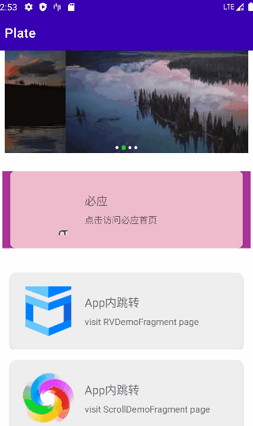

# Plate

[English Document](README.md)

Plate 是一个 `Android` 动态配置页面的基础框架。

--- 

## 特点

Plate 适用于动态配置的页面，例如`活动页`、`运营页` 、`主页`等需要服务端决定的页面。

`Plate`的能力：

- 定义远端视图数据源
- 组合并展现视图

在 `Plate` 中，配置决定页面。

我们只需要在服务端定义好一个个视图数据，并在app开发过程中实现相应组件，那么app的视图样式即可在一定程度上由服务端控制。

---

## 基本概念

- Template：模板是视图组件的分类抽象，与服务端定义的配置对应
- Component：组件是模板的具体实现，负责视图的展现。每个组件都定义了一种视图。一个完整的页面由多种组件构成

---

## Demo

构建 `app` 运行



---

## 使用方式

1、导入

gradle仓库配置:

```gradle
	allprojects {
		repositories {
			...
			maven { url 'https://jitpack.io' }
		}
	}
```

添加依赖：

```gradle
    implementation 'com.gitee.mingyueyixi:plate:v1.0.0'
```

2、初始化Plate

```kotlin
    Plate.doInit(context)
```

3、定义远端视图数据

远端定义的视图数据需要符合`plate`
预定义的结构，参考：[PlateStructure](plate-core/src/main/java/com/lu/plate/data/PlateStructure.kt)

一个远端视图列表数据，例如 [plate_sample_rv.json](app/src/main/assets/plate_sample_rv.json)

```json
{
  "contents": [
    {
      "templateId": 1,
      "id": 0,
      "props": {
        "clickLink": "app://schemas.plate.demo/app/web?url=https%3A%2F%2Fwww.biying.com",
        "title": "必应",
        "subTitle": "点击访问必应首页",
        "img": "https://cn.bing.com/rp/ar_9isCNU2Q-VG1yEDDHnx8HAFQ.png"
      },
      "style": {
        "background": {
          "shape": "rectangle",
          "solid": {
            "color": "#FFAA3399"
          }
        },
        "marginBottom": "100dp"
      }
    }
  ],
  "timeStamp": 0,
  "type": 0,
  "version": 0
}
```

记住其中的 `templateId`，后面需要进行注册。

4、实现模板与组件

```kotlin

class LeftImgLayoutTemplate(plate: Plate, templateId: Int) : BaseTemplate(plate, templateId) {

    override fun createSVComponent(parent: ViewGroup): SVComponent {
        throw NotImplementedError("LeftImgLayoutTemplate for scroll view component is not implement")
    }

    override fun createRVComponent(parent: ViewGroup, viewType: Int): RVComponent {
        return RVComponentImp(plate, viewType)
    }

    class RVComponentImp(plate: Plate, templateId: Int) : BaseRVComponent(plate, templateId) {

        override fun onCreateViewHolder(
            parent: ViewGroup,
            viewType: Int
        ): BasePlateRecyclerAdapter.BVH {
            val inflater = LayoutInflater.from(parent.context)
            val binding = LeftImgLayoutImgBinding.inflate(inflater, parent, false)
            return BasePlateRecyclerAdapter.BVH(this, binding.root)
        }

        override fun onBindView(
            adapter: BasePlateRecyclerAdapter,
            holder: BasePlateRecyclerAdapter.BVH,
            position: Int
        ) {
            super.onBindView(adapter, holder, position)
            val binding = LeftImgLayoutImgBinding.bind(holder.itemView)
            adapter.getItem(position)?.props?.let {
                applyHeaderImg(binding, it)
                binding.cardTitle.text = it.optString("title")
                binding.cardTitleSub.text = it.optString("subTitle")
            }

        }

        private fun applyHeaderImg(binding: LeftImgLayoutImgBinding, props: JsonObject) {
            val img = props.optString("img").ifBlank { null } ?: return
            Glide.with(binding.root.context)
                .load(img.trim())
                .disallowHardwareConfig()
                .into(binding.ivHeader)
        }

    }

}

```

5、注册模板

每个模板都有一个`templateId`，根据id注册模板：

```kotlin
val plate = Plate().also {
    it.register(LeftImgLayoutTemplate(it, 1))
}
```

6、应用RecyclerView视图

上文实现的`RVCompoent`组件，实际是基于`RecyclerView.Adapter`实现的，因此，我们需要一个`RecyclerView`并进行配置：

```kotlin

private fun initView() {
    val atapter = plate.createRecyclerAdapter(mPlateData).also {
        binding.recyclerView.adapter = it
        binding.recyclerView.layoutManager =
            LinearLayoutManager(activity, LinearLayoutManager.VERTICAL, false)
    }

    atapter.setOnClickListener { adapter, _, p ->
        val content = adapter.getItem(p)
        content?.props?.optString("clickLink").let {
            //跳转链接
            activity?.let { act ->
                AppLinkRouter.route(act, it)
            }
        }

    }

}

```

## LICENSE

`Plate` 使用[MulanPSL2](http://license.coscl.org.cn/MulanPSL2) 开源许可证